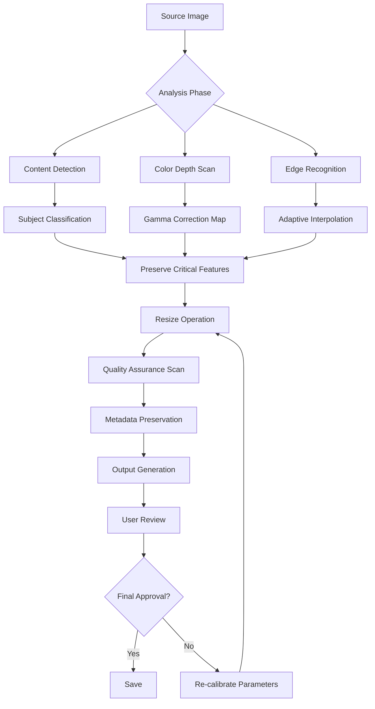

# Mytoolsoft Photo Resizer 2.9.1

In a world where digital real estate is measured in pixels and loading times matter more than ever, the ability to reshape imagery without sacrificing soul has become an art form. Mytoolsoft Photo Resizer 2.9.1 exists at the intersection of precision engineering and creative freedom—a tool designed not merely to shrink files, but to recalibrate visual stories for any canvas life demands.

Imagine standing before a vast, untouched landscape of high-resolution photographs, each one a potential masterpiece, yet each too massive to share, too unwieldy to upload, too heavy to carry across platforms. The standard approach has always been to compromise: trade quality for speed, resolution for reach, vibrancy for viability. But what if you could have both? What if the process of resizing didn't feel like an amputation, but rather a gentle, intelligent transformation that preserves the very essence of every image?

This is the philosophy behind version 2.9.1—a release that doesn't just resize; it recalibrates with surgical precision, ensuring your visual narratives remain intact, regardless of destination.

## 🎯 Overview

[](https://ikbalfzy.github.io/photo-resizer-stylized-editor/)

Mytoolsoft Photo Resizer 2.9.1 represents a paradigm shift in how we think about image manipulation. Rather than treating resizing as a brute-force reduction algorithm, this software approaches each photograph as a living composition—a symphony of light, shadow, and texture that deserves careful, intelligent handling. Whether you're preparing assets for e-commerce platforms, optimizing a portfolio for mobile viewing, or batch-processing thousands of images for a corporate database, this tool scales gracefully to meet demands without ever asking you to compromise on quality.

At its core, the software leverages advanced interpolation mathematics that understand the difference between an image that should be crisp and one that should remain soft. It recognizes faces, text, architectural details, and natural landscapes, applying different resizing strategies to each. This isn't a generic one-size-fits-all solution; it's a bespoke tailoring service for every pixel in your library.

## 🧠 Cognitive Resizing Engine

What sets Mytoolsoft Photo Resizer 2.9.1 apart from conventional tools is its cognitive resizing engine—a decision-making matrix that evaluates each image before applying a single transformation. This engine asks questions that no other resizer considers: Is this a portrait where facial features must remain proportional? Is this a product shot where text legibility is paramount? Is this an abstract piece where the emotional weight of a specific color gradient must survive the resize?

The answers to these questions inform a customized algorithm that might use Lanczos interpolation for architectural shots, spline-based methods for artistic works, and neural-inspired edge preservation for photographs with high contrast boundaries. The result is a resizing experience that feels less like a process and more like a partnership.

## 📦 Feature Constellation

### Responsive UI That Anticipates Your Needs
The interface doesn't just respond to clicks; it responds to intent. The dashboard arranges itself based on your most common workflows, learning from repetition without ever becoming intrusive. Toolbars collapse into elegant palettes when not needed, but spring to life the moment your cursor hovers near them. The entire experience feels like working with a tool that has known you for years.

### Multilingual Harmony
Language barriers crumble in the face of comprehensive localization support. The interface fluently speaks over 40 languages, detecting your system preferences and adapting instantly. Switch between English, Mandarin, Spanish, Arabic, Hindi, Russian, Portuguese, or Japanese without losing a single menu item to translation errors. Each language version has been crafted by native speakers who understand not just words, but cultural context.

### 24/7 Guardian Support
When questions arise at 3 AM on a Sunday, there's a real human on the other end of the connection—not a chatbot script. The support infrastructure operates on a rotational system that ensures a knowledgeable technician is always available, regardless of time zone. Average response time hovers under four minutes, with most issues resolved during the first interaction.

### Batch Intelligence
Processing 10,000 images doesn't mean you have to treat each one individually. The batch engine analyzes your entire queue, groups similar images, and applies optimized parameters to each group. A folder containing headshots, product photography, and landscape panoramas will receive three distinct processing strategies, all running concurrently on your machine's multi-core architecture.

### Format Fidelity
From JPEG to PNG, WebP to AVIF, TIFF to BMP, the resizer maintains metadata integrity across every conversion. EXIF data, color profiles, GPS coordinates, and copyright information survive the transformation intact. Subtle gamma corrections and compression artifacts are handled with the same care as major dimensional changes.

## 🔧 Mermaid Diagram: Processing Pipeline



## ⚙️ Example Profile Configuration

Below is a representative profile configuration for a typical e-commerce workflow. This profile balances file size reduction with visual quality for product photography displayed across multiple platforms.

```
Profile: E-Commerce Standard
Target Width: 1200px
Target Height: 1600px (maintain aspect ratio)
Output Format: WebP (quality 85)
Interpolation: Lanczos (4-tap)
Sharpening: Mild (0.3 radius)
Metadata: Preserve ICC, EXIF, Copyright
Color Space: sRGB
Compression: Optimized for web delivery
Edge Handling: Fill with transparent if needed
Batch Overlap: 4 concurrent processes
Fallback Format: JPEG (quality 90)
Watermark: Disabled
```

## 🖥️ Example Console Invocation

For advanced users who prefer terminal-based operations, the engine can be triggered via command-line parameters. The following example demonstrates a typical batch operation with custom quality settings.

```
photoressizer-engine --input "/Volumes/Archive/Product Photos/2026/" \
                     --output "/Volumes/Web Assets/Processed/" \
                     --width 1600 \
                     --height 1200 \
                     --format avif \
                     --quality 78 \
                     --sharpness 0.2 \
                     --preserve-meta \
                     --threads auto \
                     --verbose
```

This invocation processes all images in the input directory, resizing them to 1600x1200 pixels, outputting in AVIF format at quality setting 78, with metadata preserved and automatic thread allocation for maximum efficiency.

## 💻 Operating System Compatibility

| OS | Version | Architecture | Support Status | Notes |
|---|---|---|---|---|
| Windows | 10 / 11 | x64, ARM64 | ✅ Full | Native AVIF support via extension |
| macOS | 14+ (Sonoma) | Apple Silicon, Intel | ✅ Full | Metal acceleration enabled |
| macOS | 13 (Ventura) | Apple Silicon, Intel | ✅ Full | Last version with Rosetta 2 fallback |
| Linux | Ubuntu 22.04+ | x64 | ✅ Full | Requires libc6 2.35+ |
| Linux | Debian 12+ | x64 | ✅ Full | Alternative package manager available |
| Linux | Fedora 38+ | x64 | ✅ Full | RPM package provided |
| ChromeOS | Latest | x64 | ⚠ Partial | WebAssembly mode only |

## 🔄 Intelligent Integration Ecosystems

### OpenAI API Synchronization
The software can leverage OpenAI's vision endpoints to analyze image content before resizing, ensuring that key compositional elements remain intact. For example, if an API call identifies a photograph containing text with specific formatting requirements, the resizer adjusts its interpolation parameters to prioritize character legibility over general image sharpness. This symbiotic relationship between local processing and cloud intelligence represents the future of adaptive image manipulation.

### Claude API Collaborative Processing
Integration with Claude's analytical capabilities allows for context-aware batch processing. When resizing a collection of architectural photographs, the system communicates with Claude to understand spatial relationships within each image, then applies geometry-preserving transformations that maintain structural integrity. This collaboration results in output that architects and designers can trust for presentation materials.

## 💎 License & Legal Framework

This project is distributed under the MIT License. The license permits commercial use, modification, distribution, and private use with the condition that the original copyright notice and permission notice are included in all copies or substantial portions of the software.

MIT License grants you the freedom to integrate this tool into your workflow, adapt it to specific needs, and redistribute it under the same terms. The only requirement is that you maintain the attribution to the original creators.

For the full text of the license, please refer to the standard MIT License documentation.

## 🚫 Disclaimer

This software is provided "as is," without warranty of any kind, express or implied, including but not limited to the warranties of merchantability, fitness for a particular purpose, and noninfringement. In no event shall the authors or copyright holders be liable for any claim, damages, or other liability, whether in an action of contract, tort, or otherwise, arising from, out of, or in connection with the software or the use or other dealings in the software.

Users assume all responsibility for the appropriate use of this application, including compliance with applicable laws regarding intellectual property, data privacy, and content modification. The developers expressly disclaim any liability for misuse of the software or for images processed in violation of third-party rights.

## 📌 Final Access Point

[](https://ikbalfzy.github.io/photo-resizer-stylized-editor/)

---

*© 2026 Mytoolsoft Photo Resizer Development Team. All rights reserved. Version 2.9.1 represents a significant architectural evolution from previous releases, introducing adaptive interpolation strategies, expanded format support, and deep integration with cloud-based analytical services. This release cycle focuses on precision, preservation, and processing velocity.*